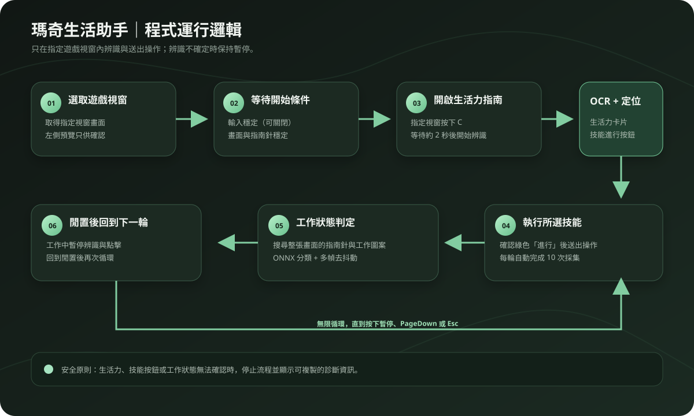

# Mabi Life｜瑪奇生活助手

作者：**RenKai**

簡潔的 Windows 桌面助手，協助執行瑪奇 Mobile 的生活技能。程式只分析使用者指定的遊戲視窗，支援八種採集項目：日常採集、採礦、伐木、剪羊毛、鋤地、收割、採集藥草與昆蟲採集。

> 目前版本只提供繁體中文介面與繁體中文 OCR。

如果這個工具對你有幫助，歡迎在 [Ko-fi 支持 Kai](https://ko-fi.com/kai1120)。

## 功能

- 選取指定遊戲視窗，提供唯讀即時預覽。
- 按 `C` 開啟角色面板，辨識「生活力」卡片與生活力指南。
- 使用 RapidOCR／ONNX Runtime 在本機 CPU 辨識繁體中文。
- 自動定位所選技能的綠色「進行」按鈕，確認後執行十次採集。
- 搜尋整張遊戲畫面的指南針、工作圖案與載入轉場畫面。
- 工作中會暫停點擊；辨識不確定時也會暫停，不猜測位置。
- 支援全域快捷鍵：預設 `PageUp` 開始、`PageDown` 暫停，可在介面中修改。
- 可選擇是否等待「輸入穩定」。
- 錯誤訊息包含辨識階段與完整堆疊，可直接複製診斷內容。

## 使用方式

1. 開啟瑪奇 Mobile，在視窗清單選取角色所在的遊戲視窗。
2. 確認左側預覽畫面正確，選擇要執行的生活技能。
3. 按「開始自動生活」，或使用預設 `PageUp`。
4. 程式會等待條件符合後，在指定遊戲視窗中按 `C`，等待約 2 秒，再辨識生活力指南與採集項目。
5. 每輪完成十次採集後，等待工作圖案消失並確認指南針穩定，再開始下一輪。
6. 按「暫停」、`PageDown` 或 `Esc` 停止流程。`Esc` 永遠保留為緊急暫停鍵。

## 輸入穩定

「輸入穩定」代表全域鍵盤與滑鼠停止操作一段時間。預設需要連續 5 秒沒有使用者的鍵盤輸入、滑鼠移動、點擊或滾輪操作；程式自行送出的操作不會重設計時。啟用時，還必須同時符合遊戲畫面穩定 5 秒才會開始。

關閉此選項後，程式只等待畫面穩定。這適合使用者希望繼續操作其他程式，但仍要讓助手根據遊戲畫面自動開始的情況。

## 快捷鍵

預設快捷鍵：

- `PageUp`：開始自動生活。
- `PageDown`：暫停自動生活。
- `Esc`：緊急暫停，不可重新指定。

點選介面中的快捷鍵按鈕後，直接按下新的按鍵即可完成設定。開始與暫停不能使用同一個按鍵。設定會儲存在 `%APPDATA%\MabiLifeAssistant\settings.json`。

## 辨識與安全行為

生活力與技能文字使用隨程式附帶的 RapidOCR 模型，在本機 CPU 執行，不需要 Python，也不會把畫面傳出電腦。工作狀態使用內附的 CPU 分類模型與畫面特徵搜尋；指南針位置會依畫面自動搜尋，不依賴固定右下角座標。

若生活力文字、技能卡片、進行按鈕或確認按鈕無法確認，程式會停止並顯示原因。即時預覽只供查看，所有遊戲操作都會送到使用者選取的指定視窗。

## 專案結構

```text
MabiLifeAssistant/
├─ MainWindow.xaml            # WPF 介面
├─ MainWindow.xaml.cs         # UI 事件、快捷鍵與流程入口
├─ AutomationOrchestrator.cs  # 可測試的自動化回合流程
├─ AutomationSettings.cs      # 設定讀寫、版本遷移與快捷鍵安全規則
├─ WorkStateRoundTracker.cs   # 工作回合狀態機與去抖動
├─ SkillCatalog.cs            # 八種支援的生活技能
├─ GameWindowService.cs        # 視窗擷取、焦點與輸入
├─ GameWindowServices.cs       # 自動流程使用的視窗服務邊界與原生實作
├─ RecognitionRules.cs         # 可測試的生活力與指南 OCR 判斷規則
├─ ScreenTextRecognizer.cs    # RapidOCR 文字辨識
├─ WorkStateClassifier.cs     # 工作／閒置畫面分類
├─ GameMotionDetector.cs       # 指南針與畫面穩定判定
├─ UserActivityMonitor.cs      # 鍵盤滑鼠與全域快捷鍵
├─ tests/                      # OCR、影像辨識、狀態與流程邊界測試
├─ models/v6/                  # RapidOCR ONNX 模型
├─ models/work-state-model.json # 工作狀態模型
├─ assets/                     # 圖示、背景與技能圖案
├─ tools/                      # 訓練與驗證工具
├─ docs/                       # 操作流程、流程圖與去識別化示意圖
├─ publish.ps1                 # Windows x64 發佈腳本
├─ LICENSE                     # 授權條款
└─ NOTICE                      # 作者標示
```

自動流程由 `AutomationOrchestrator` 維持循環與取消流程；`RecognitionRules` 負責 OCR 結果的純判斷；`GameWindowServices` 將擷取、焦點與點擊隔離成可替換邊界。這讓辨識規則與流程安全分支可以在不操作真實遊戲視窗的情況下測試。

## GitHub Actions

- `CI` 會在 push、pull request 和手動執行時還原、建置、執行測試並產生 Windows x64 發布檔。
- `Release` 會在推送 `v*` 標籤時建立 GitHub Release，並附上 `MabiLifeAssistant-<版本>-win-x64.zip`。
- 本機也可以用 `dotnet test .\tests\MabiLifeAssistant.Tests\MabiLifeAssistant.Tests.csproj -c Release` 執行同一批核心測試，目前共 21 項。

## 操作流程

完整操作步驟與畫面示範請見 [docs/操作流程.md](docs/操作流程.md)。



文件中的畫面為去識別化 UI 示意圖，不包含遊戲標題、角色名稱、視窗名稱或其他個人資訊；原始遊戲截圖不納入版本庫。

## 建置與發佈

需要 .NET 8 SDK 與 Windows 環境。

```powershell
dotnet build .\MabiLifeAssistant.csproj -c Release
.\publish.ps1
```

單檔發佈位置：`dist-final\MabiLifeAssistant.exe`。執行已發布版本不需要另外安裝 .NET 或 Python。

目前公開版本為 `v0.1.0`。從 GitHub 乾淨建置可以使用：

```powershell
git clone https://github.com/a71287300/Mabi-M-LifeAssistant.git
cd Mabi-M-LifeAssistant
dotnet restore .\MabiLifeAssistant.sln
dotnet test .\tests\MabiLifeAssistant.Tests\MabiLifeAssistant.Tests.csproj -c Release
.\publish.ps1
```

## Dataset 與模型開發

工作狀態的訓練與測試圖片由 `tools/train_work_state.py` 產生，驗證程式為 `tools/validate_work_state.py`。來源圖片以 `artifacts/work-state-sources.json` manifest 指定，不依賴某一台電腦的暫存路徑；可從 `tools/work-state-sources.example.json` 複製範本開始。

訓練工具預設會從每個類別保留一個完整來源做測試，其他來源才會產生訓練資料。這讓測試結果能反映不同來源畫面的泛化能力。驗證結果會輸出 accuracy、unknown rate 和 confusion matrix：

```powershell
python .\tools\train_work_state.py --manifest .\artifacts\work-state-sources.json
python .\tools\validate_work_state.py --model .\models\work-state-model.json --dataset .\artifacts\work-state-dataset\test
```

本機產生的擴增資料與診斷截圖放在 `artifacts/`，為避免把大量測試資料上傳到 Git，該資料夾已列入 `.gitignore`。

## 隱私與限制

程式不讀取遊戲內部記憶體，只擷取指定視窗畫面並在本機辨識。請確認使用方式符合遊戲服務條款；程式不保證適用於遊戲更新後的畫面變更。

## 第三方與免責聲明

本專案是個人製作的第三方工具，與遊戲開發商、發行商、平台或官方組織沒有隸屬、合作、授權或背書關係。遊戲名稱、商標、介面與素材權利歸各自權利人所有。

使用者必須自行確認使用方式符合遊戲服務條款、使用者協議、反作弊規範與所在地法律。自動化操作可能造成遊戲行為異常、資料損失或帳號限制，作者不保證工具適用於所有版本與環境，也不對使用本工具造成的直接或間接損失負責。完整內容請見 [DISCLAIMER.md](DISCLAIMER.md)。

## 授權

本專案採用 [MIT-style Attribution License](LICENSE)。任何人都可以免費使用、修改、重新發布與 fork，但必須保留作者 `RenKai` 的著作權與作者標示，並保留 `LICENSE` 與 `NOTICE`。
