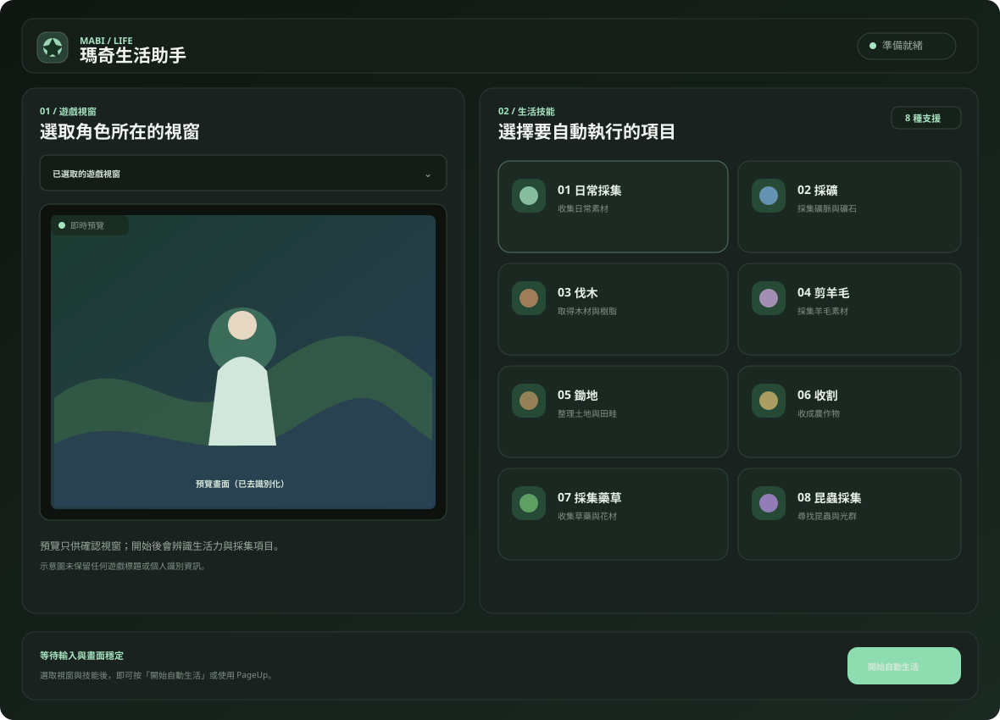
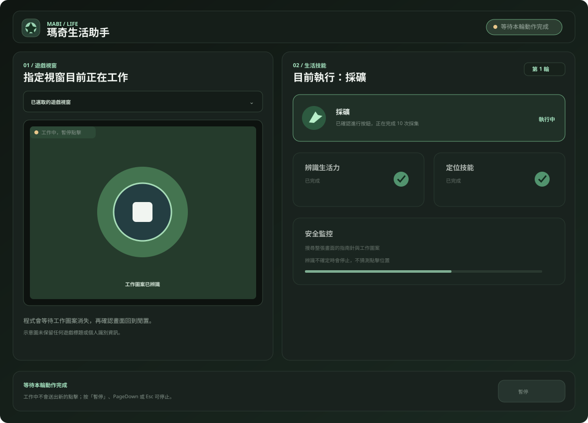

# 瑪奇生活助手｜操作流程

目前版本只提供**繁體中文介面**與繁體中文 OCR。

為保護使用者隱私，本文件的操作畫面使用去識別化 UI 示意圖，不保留遊戲標題、角色名稱、視窗名稱或其他個人資訊。

## 1. 選取遊戲視窗與技能

開啟程式後，按「重新整理」，在清單中選取瑪奇 Mobile 的角色視窗，再選擇八種生活技能其中一項。

## 2. 開始自動生活

確認預覽畫面正確後，按「開始自動生活」，或使用預設 `PageUp`。程式會依序等待輸入與畫面穩定、按下 `C`、等待約 2 秒，然後辨識生活力指南與所選技能。

## 3. 等待每輪完成

確認「進行」後，程式會讓遊戲完成一輪十次採集。工作中會暫停檢查，回到閒置後再進入下一輪。

## 4. 暫停與診斷

- 按「暫停」、`PageDown` 或 `Esc` 可停止流程。
- 發生辨識問題時，按「複製診斷」即可複製完整錯誤內容。
- 關閉「等待輸入穩定」後，程式仍會等待遊戲畫面穩定，但不再等待全域鍵盤滑鼠停止。

## 程式運行邏輯

## 免責聲明

本工具為第三方非官方工具，與遊戲開發商、發行商、平台或官方組織沒有隸屬、合作、授權或背書關係。遊戲名稱、商標、介面與素材權利歸各自權利人所有。

使用者必須自行確認使用方式符合遊戲服務條款、反作弊規範與所在地法律。自動化操作可能造成遊戲行為異常、資料損失或帳號限制，作者不保證工具適用於所有版本與環境，也不對使用本工具造成的損失負責。完整內容請見 [DISCLAIMER.md](../DISCLAIMER.md)。
